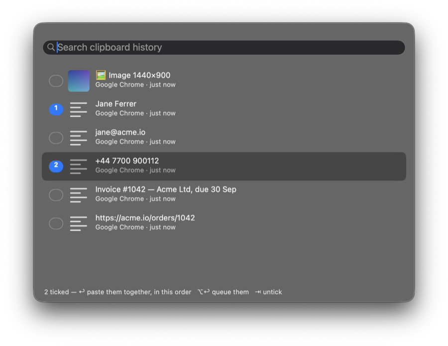

# ClipStack

Clipboard history you can browse, search, and paste from — including **several
clips at once**. Text, images, videos and files.

Everything you copy is recorded in the background. When you need something back,
open the picker, tick as many clips as you want, and either merge them into one
paste or queue them to paste one after another.

Runs on **macOS**, **Windows**, and **iPhone / iPad** (through the Shortcuts app).

<p align="center">
  
</p>

<p align="center">
  <br>
  <sub>The picker on macOS (<code>clipstack pick</code>): tick several, press OK.</sub>
</p>

Replay the tour yourself with `./demo/demo.sh`. It uses a throwaway history and
a private pasteboard, so your own clipboard is left alone.

---

## The two multi-item modes

This is the point of the tool, so it's worth being precise about the difference.

**Merge** — tick 3 clips, get one paste containing all 3, joined by a separator.
Use it when everything lands in a single field.

```
clips:  "Jane Ferrer"  +  "jane@acme.io"  +  "+44 7700 900112"
paste:  Jane Ferrer
        jane@acme.io
        +44 7700 900112
```

**Queue** — tick 3 clips, then paste them into three *different* places. Each
time you hit the "next" hotkey, the following clip is loaded onto the clipboard.

```
clips:  "Jane Ferrer"  +  "jane@acme.io"  +  "+44 7700 900112"

  Name  [Jane Ferrer      ]   <- Cmd/Ctrl+V
  Email [jane@acme.io     ]   <- next, then Cmd/Ctrl+V
  Phone [+44 7700 900112  ]   <- next, then Cmd/Ctrl+V
```

---

## macOS

Two pieces: a small background recorder, and the built-in **Shortcuts** app as
the picker. Shortcuts has no "clipboard changed" trigger, so it cannot do the
recording — but its `Choose from List` action has a *Select Multiple* toggle,
which is exactly the picker this needs.

### Install

```sh
./macos/install.sh
```

That builds the binary to `~/.local/bin/clipstack`, installs a launch agent so
the recorder starts at login, and generates three signed `.shortcut` files.

Then, once:

1. Double-click each file in `macos/` and click **Add Shortcut**:
   - `ClipStack - Paste Multiple.shortcut` ← the main one
   - `ClipStack - Queue Multiple.shortcut`
   - `ClipStack - Paste Next.shortcut`
2. In Shortcuts, select each one, open the ⓘ panel, and assign a key:
   | Shortcut | Suggested key |
   |---|---|
   | Paste Multiple | `⌘⇧V` |
   | Queue Multiple | `⌘⇧Q` |
   | Paste Next | `⌘⇧N` |
3. **Shortcuts → Settings → Advanced → Allow Running Scripts.**

### If you'd rather skip Shortcuts

The binary has its own picker built on AppleScript, no import required:

```sh
clipstack pick              # tick several, merged onto the clipboard
clipstack pick --queue      # tick several, start a paste queue
clipstack pick --join ", "  # merge with a different separator
```

### Command line

```sh
clipstack list --pretty            # browse history
clipstack search invoice --pretty  # filter it (the numbers match `list`)
clipstack copy 3                   # put clip #3 back on the clipboard
clipstack merge 4 3 2              # merge #4, #3, #2 onto the clipboard, in that order
clipstack merge 4 3 --join ", "    # …with a different separator
clipstack queue 4 3 2              # queue them instead; #4 is on the clipboard now
clipstack next                     # advance the paste queue
clipstack pin 0                    # keep a clip from ageing out
clipstack status                   # where things live
clipstack clear                    # wipe history (pinned clips survive)
```

### Settings

Create `~/Library/Application Support/ClipStack/config.json` with any of these
keys; the ones you leave out keep their defaults:

```json
{
  "maxItems": 500,
  "listLimit": 60,
  "pollSeconds": 0.5,
  "maxChars": 1000000,
  "ignoredBundleIDs": ["com.1password.1password", "com.bitwarden.desktop"]
}
```

`listLimit` is how many clips the pickers offer. `ignoredBundleIDs` replaces the
built-in list of password managers, so keep those in it. Restart the recorder
afterwards: `launchctl kickstart -k gui/$UID/com.clipstack.watcher`.

The image and video settings are covered in the next section.

### Images, videos and files

Everything comes back the way it was copied:

| You copy… | ClipStack keeps | Pasting it back gives |
|---|---|---|
| a screenshot, or *Copy Image* in a browser or Preview | the image, once, in `media/` | the image (plus TIFF for older apps) |
| video data (QuickTime *Copy*, for instance) | the video, once, in `media/` | the video, and a file apps can attach |
| files in Finder — videos, photos, anything | only their paths | the files themselves |

In listings they show up as `🖼 Image 1440×900`, `🎬 Video 12.4 MB`,
`🎬 holiday.mov` or `🗂 3 files: …`, and `search image` finds them.

Merging a mix pastes it the way the destination can take it:
- **Only text:** one piece of text.
- **Only files:** all the files at once.
- **Anything with an image or video:** a rich document with the pictures
  inline, plus the text on its own for plain fields.

Queueing pastes each clip whole, so an image, then a caption, then a link
works fine.

It is built to stay out of the way:
- **Files cost nothing.** A 4 GB video copied in Finder is stored as one line of text.
- **Images are stored as copied.** PNG, JPEG, HEIC and GIF are never re-encoded;
  only TIFF, which is uncompressed, is converted to PNG. Each file is named by a
  hash of its content, so the same image is stored once however often you copy it.
- **Nothing slows your copying.** Hashing, converting and saving happen on a
  low-priority background queue. The recorder keeps polling meanwhile, so quick
  copies made while a big image is saved are all caught, in order (`tests/test-macos.sh`
  checks this with a 45 MB image).
- **Size is read from the image header,** so listing never decodes a picture.
- **Pasting back is tagged**, so the recorder doesn't read and hash the same
  image again when ClipStack itself pastes it.
- **Disk use is capped.** Images and videos over `maxMediaMB` (default 100) are
  skipped. Once they add up to `mediaBudgetMB` (default 1024), the oldest go
  first, and their files are deleted along with them.

```json
{ "recordMedia": true, "maxMediaMB": 100, "mediaBudgetMB": 1024 }
```

Set `recordMedia` to `false` to keep text and files only. `clipstack status`
shows how much space images and videos use.

### Managing the recorder

```sh
launchctl bootout  gui/$UID/com.clipstack.watcher   # stop
launchctl bootstrap gui/$UID ~/Library/LaunchAgents/com.clipstack.watcher.plist
tail -f ~/Library/Logs/clipstack.log                # logs
./macos/uninstall.sh                                # remove
```

---

## iPhone & iPad

Five shortcuts, nothing else to install. iOS lets nothing watch the clipboard in
the background, so **saving a clip is one tap** here instead of automatic.
Picking, merging and queueing work as they do on the Mac, for text, images and
videos alike.

### Install

Open each file in `ios/` on the iPhone or iPad and tap **Add Shortcut**. On
GitHub, tap the file, then **Download**. If your Shortcuts sync through iCloud,
you can instead double-click them on a Mac and they will appear on your other
devices.

| Shortcut | Does |
|---|---|
| `ClipStack iOS - Save` | Adds what's on the clipboard to history (text, an image or a video), or whatever you share to it from the share sheet |
| `ClipStack iOS - Paste Multiple` | Tick several clips; text is merged onto the clipboard, one per line. With images or videos among them, each goes on as its own item |
| `ClipStack iOS - Queue Multiple` | Tick several; the first goes on the clipboard, the rest wait |
| `ClipStack iOS - Paste Next` | Loads the next queued clip |
| `ClipStack iOS - Clear` | Empties history and the queue and deletes saved images and videos (asks first) |

Picked clips are pasted top to bottom, in the order the list shows them (newest
first).

### Make saving one tap

- **Back Tap** (iPhone): Settings › Accessibility › Touch › Back Tap › Double
  Tap › `ClipStack iOS - Save`. Copy something, tap the back of the phone twice.
- **Action Button** (iPhone 15 Pro and later): Settings › Action Button › Shortcut.
- **Share sheet**: select text, or a photo or video in Photos, tap Share ›
  `ClipStack iOS - Save`.
- **Control Center** or a **Home Screen widget**: add Save, Paste Multiple and
  Paste Next for quick access, which is handy on iPad.

### The first run

Each shortcut asks once before it reads the clipboard, saves a file or shows a
notification. Choose **Always Allow** so it stops asking. If iOS keeps asking
before *pasting*, set Settings › Apps › Shortcuts › Paste from Other Apps to
**Allow**. Clear also asks you to confirm deleting the `media` folder each time.

### Where it keeps things

`iCloud Drive › Shortcuts › ClipStack` (or `On My iPhone › Shortcuts › ClipStack`
when iCloud Drive is off), in `history.txt` and `queue.txt`. The newest 200
clips are kept. With iCloud Drive on, these files sync like any other iCloud
Drive file.

Images and videos are saved as they are, once each, in `ClipStack/media`, named
by a hash of their content. History lists them as, for example,
`🖼 Image 1.2 MB — 3f9a1c2b0d4e.png`, and pasting gives back the picture or the
video itself. They stay until you run Clear. Save records a video the size it
is, so saving long videos fills space quickly.

Password managers' "don't record this" markers aren't visible to Shortcuts, so
just don't run Save on a password.

To rebuild the shortcuts after changing `ios/make-shortcuts.py`, run it on a Mac;
`shortcuts sign` needs macOS.

---

## Windows

One self-contained PowerShell file. Nothing to install — the C# inside it is
compiled at launch by the compiler that ships with Windows.

### Install

Double-click **`windows\Install-ClipStack.cmd`**. It registers ClipStack to
start with Windows and launches it. Look for the notification-area icon.

To try it once without installing, run `windows\Run-ClipStack.cmd` — that keeps
a console window open so any errors are visible. Only one copy runs at a time;
starting another just says it's already running.

### Keys

| Key | Does |
|---|---|
| `Ctrl+Shift+V` | Open the picker |
| `Ctrl+Shift+N` | Load the next queued clip |

Inside the picker:

| Key | Does |
|---|---|
| *type* | Filter |
| `↑` `↓` | Move |
| `Tab` | Mark / unmark (marks are numbered in paste order) |
| `Enter` | Paste — marked clips merged, or the highlighted one |
| `Alt+Enter` | Queue the marked clips instead |
| `Ctrl+1`…`9` | Paste that clip straight away |
| `Ctrl+P` | Pin |
| `Ctrl+D` | Delete |
| `Esc` | Close |

The merge separator (new line, blank line, comma, space, tab) is in the
tray icon's right-click menu.

Windows already has `Win+V`. ClipStack sits alongside it and adds search,
unlimited history, and the merge/queue modes.

**Images and files.** Copied images are kept as PNG in `media\`, once each, and
paste back as images (transparency included). Files copied in Explorer, videos
among them, are kept by reference and paste back as the files. Merging text with
images gives HTML with the pictures inline (Word, Outlook, Gmail), plus the text
on its own. Encoding and saving images happens on a background thread, so the
picker and tray never wait on it. Images over 100 MB are skipped, and once they
total 1 GB the oldest go first.

---

## Where your data lives

| | |
|---|---|
| macOS | `~/Library/Application Support/ClipStack/` (images and videos in `media/`) |
| Windows | `%LOCALAPPDATA%\ClipStack\` (images in `media\`) |
| iPhone / iPad | `Shortcuts/ClipStack/` in iCloud Drive or On My iPhone (images and videos in `media/`) |

On macOS and Windows: local files, nothing synced anywhere. Last 500 clips;
pinned clips are never evicted. Files copied in Finder or Explorer are kept as
paths, not copies. If you move or delete the original, pasting that clip can't
bring it back.

**Passwords are skipped.** Both versions honour the standard "don't record this"
clipboard markers that password managers set (`org.nspasteboard.ConcealedType`
on macOS, `ExcludeClipboardContentFromMonitorProcessing` on Windows), and both
ignore copies made while a known password manager is frontmost. It is still a
plain-text file of things you copied — treat it accordingly.

To wipe everything: `clipstack clear` on macOS, the tray menu on Windows, or
`ClipStack iOS - Clear` on iPhone and iPad.

---

## Tests

```sh
./tests/test-macos.sh        # the real binary, end to end
python3 tests/test-ios.py    # the generated iOS shortcuts, in a small interpreter
./tests/check-windows.sh     # parses the PowerShell, compiles its C# for Windows PowerShell 5.1
```

`test-macos.sh` runs against a throwaway data folder and a private pasteboard
(`CLIPSTACK_HOME` and `CLIPSTACK_PASTEBOARD`), so it's safe to run while
ClipStack is recording. `check-windows.sh` needs `pwsh` and the .NET SDK and
skips whichever is missing; the C# compile works on macOS and Linux too.

---

## Troubleshooting

**macOS: a shortcut reports it can't run the script.** Turn on Shortcuts →
Settings → Advanced → Allow Running Scripts. If it still fails, the Shortcuts
sandbox is blocking the binary — use `clipstack pick` instead, which does the
same job without Shortcuts.

**macOS: nothing is being recorded.** Check the agent is up with
`launchctl print gui/$UID/com.clipstack.watcher`, and read
`~/Library/Logs/clipstack.log`.

**Windows: the hotkey does nothing.** Another app has claimed `Ctrl+Shift+V`;
ClipStack shows a balloon saying so at startup. Use the tray icon, or change the
`VK_V` / `MOD_*` constants near the top of `ClipStack.ps1`.

**macOS: the Shortcuts from `macos/` appear on my iPhone and fail there.** They
sync through iCloud, but they run a Mac program. On iPhone and iPad, use the
`ClipStack iOS - …` shortcuts instead.

**iPhone/iPad: "ClipStack is empty".** Nothing has been saved yet. Copy something
and run `ClipStack iOS - Save`.

**Windows: it pastes the wrong thing after the picker closes.** ClipStack
synthesises `Ctrl+V` and briefly releases your modifier keys first. If your
machine is slow, raise the `Thread.Sleep(140)` in `CloseAndPaste`.
